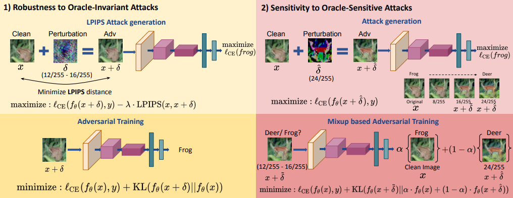
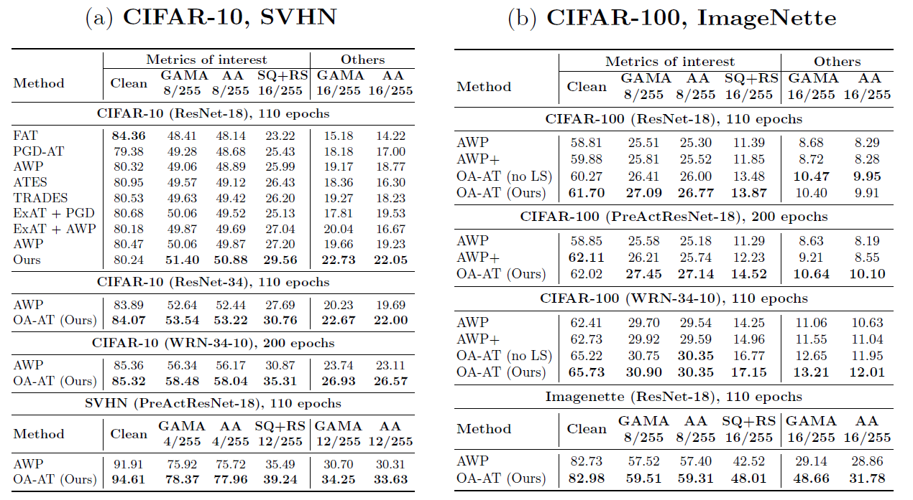

# Oracle-Aligned Adversarial Training (OA-AT)

This repository contains code for the implementation of our paper titled [Scaling Adversarial Training to Large Perturbation Bounds](https://arxiv.org/abs/2210.09852), accepted at the ECCV-2022 



 # Environment Settings 
* Python 3.6.9
* PyTorch 1.7
* Torchvision 0.8.0
* Numpy 1.19.2

The checkpoints can be found at [Google Drive](https://drive.google.com/drive/u/3/folders/14uZoWixUUSGmF5vl-O6ZBIcAJghDaoyd)
# Working  details
## Training example

Training the proposed approach Oracle-Aligned Adversarial Training on WideResNet-34-10 architecture for CIFAR-10:
```
python train_OAAT.py --use_defaults CIFAR10_WRN
```
Alternatively, the training settings can be changed as follows:
```
python train_OAAT.py --use_defaults NONE --beta 2 --beta_final 3 --arch WideResNet34 --data CIFAR10 --mixup_alpha 0.45 --lpips_weight 1 --mixup_epsilon 0.06274509 --auto 1 --weight_decay 3e-4 
```
## Evaluation

Evaluating the robust performance of the trained model against [GAMA-PGD](https://github.com/val-iisc/GAMA-GAT) (100-step) and [Square](https://github.com/max-andr/square-attack) (5000 queries) attacks: 

```
python eval.py --data CIFAR10 --arch WideResNet34 --main_model ./model-cifar-WideResNet/OAAT_151_0.9996_CIFAR10_1_0.45_1_1_3_0.0003_200.pkl

```


# Citing this work
```
@inproceedings{addepalli2022scaling,
  title={Scaling Adversarial Training to Large Perturbation Bounds},
  author={Addepalli, Sravanti and Jain, Samyak and Sriramanan, Gaurang and Venkatesh Babu, R},
  booktitle={European Conference on Computer Vision},
  pages={301--316},
  year={2022},
  organization={Springer}
}
```
